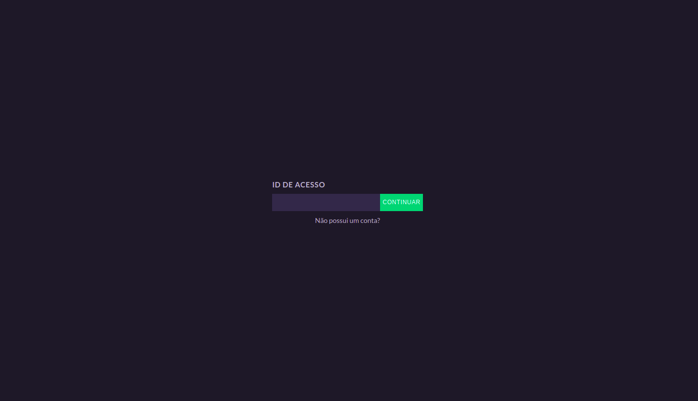
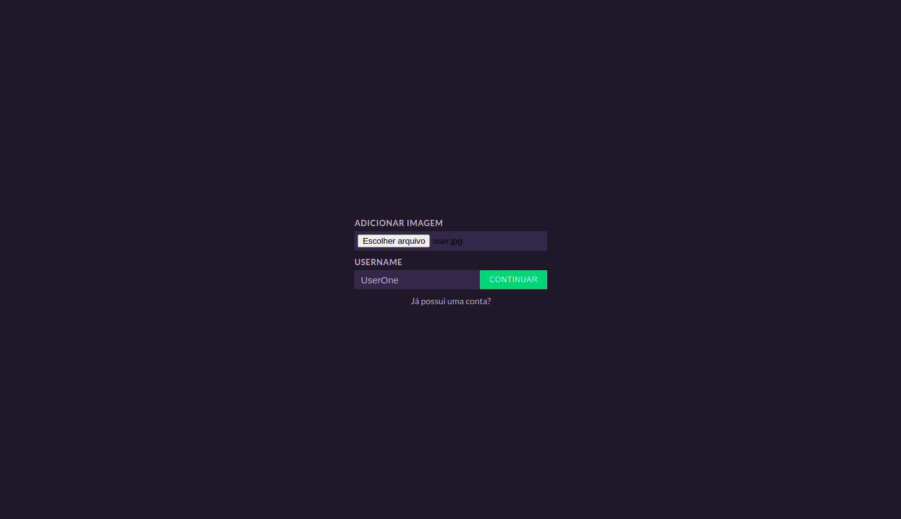
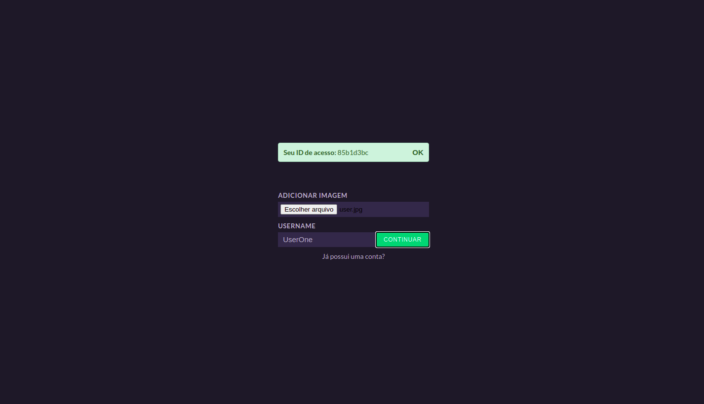
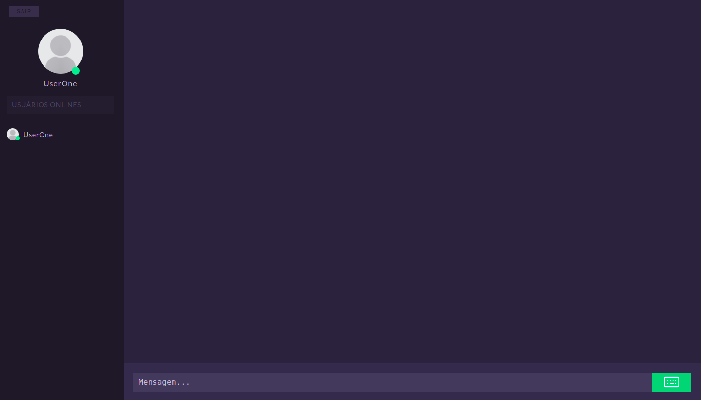
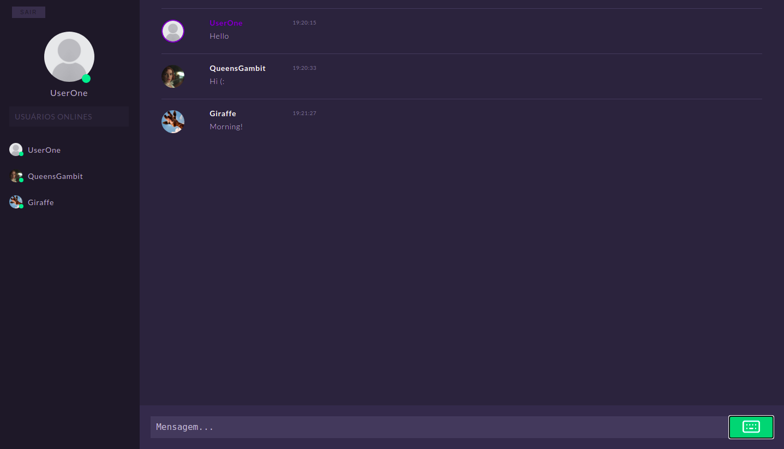

# Chat

Chat online feito com socket.io, node.js, express e react.

## Screenshots
<p align="center">Home<p>
<p align="center">
  
</p>
<p align="center">Cadastro<p>
<p align="center">
  
</p>
<p align="center">
  
</p>
<p align="center">Chat<p>
<p align="center">
  
</p>
<p align="center">
  
</p>
<p align="center">
  
</p>

## Run application
#### Run server
```
git clone https://github.com/enyasantos/chat-nodejs.git
cd server
yarn install or npm install
yarn start:dev or npm start:dev
```
#### Run frontend
```
git clone https://github.com/enyasantos/chat-nodejs.git
cd chat
yarn install or npm install
yarn start or npm start
```
## Licença 
This project is licensed under the MIT License - see the [LICENSE](https://opensource.org/licenses/MIT) page for details.
